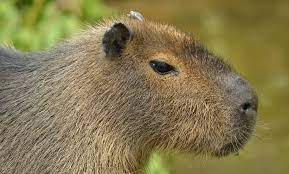

<html>

<head>
    <title>Mi primera pagina web </title>
</head>

</head>

<body>
    <ul>
        <li><a href="https://feedly.com/i/subscription/feed%2Fhttps%3A%2F%2Fpabloning.github.io%2FLLMM%2Frss%2CLLMM.xml" target="_blank">Feedly</a></li>
        <li><a href="https://www.inoreader.com/feed/https%3A%2F%2Fpabloning.github.io%2FLLMM%2Frss%2CLLMM.xml" target="_blank">Inoreader</a></li>
        <li><a href="https://pabloning.github.io/LLMM/" class="rss" target="_blank">Github</a></li>
        <li><a class="active" href="index.html" target="_blank">Inicio</a></li>
        <li><a href="Ejercicios_1º_trimestre/tablas/horario.html" target="_blank">Horario</a></li>
        <li><a href="Ejercicios_1º_trimestre/formularios/tour 2.html" target="_blank">Tour</a></li>
        <li><a href="Ejercicios_1º_trimestre/listas/RecetaTortilla.html" target="_blank">Receta Tortilla</a></li>
        <li><a href="Ejercicios_1º_trimestre/plantilla/plantilla.html" target="_blank">Plantilla</a></li>
        

    </ul>
    

    <h1 text-align="center">Hola chicos</h1>
    

    <!--esto es un salto de línea-->
    
 

    
<a href="https://youtu.be/VSkHigX9x1o" target="_blank">Somos españoles y nos gustan los
            capibaras</a>

    

        

            <h3>Sobre este sitio</h3>
            
Propiedad de : Pablo

            
Pablo Gallego

        

        

            <h3>Contactame</h3>
            

                <a href="rss,LLMM.xml" target="_blank"><input type="button" value="rss"></a>
            

        

        

    

</body>

</html>
